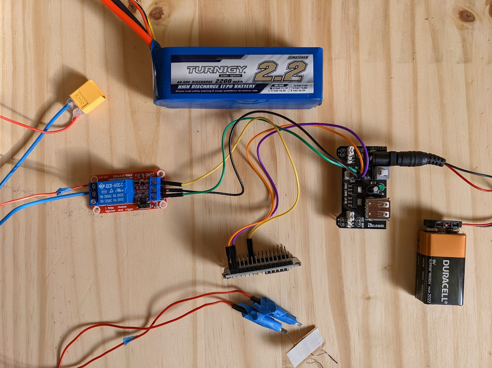

# Sureshot
### A simple model rocket ignition solution - Wirelessly launch your rockets with reliability!

## Okay, but what is it?
An Arduino web server that serves a simple web app for controlling a relay connected to the arduino.  
**Altogether:**  
web app button -> arduino -> relay -> ignitor -> 🚀

## Why?
After learning that the Estes wired AA-powered ignition remote I had since childhood was unable to ignite Estes' "new" black powder-less igniters, and realizing I needed a solution with higher amperage, this became my reliable ignition solution. A web app interface was chosen instead of physical buttons so it can be put together with little to no soldering and minimal wiring. See [Recommended Setup](#recommended-setup).

## Overview
This project is intended for the ESP8266 NodeMCU 1.0 variant. It uses SPIFF. Use [esp8266-filesystem-uploader](https://github.com/esp8266/arduino-esp8266fs-plugin) to upload the files. Note that `esp8266-filesystem-uploader` is only available for Arduino IDE 1.x at this time as it hasn't been written for the IDE 2.x framework. [See this issue concerning the plight of 1.X plugins](https://github.com/arduino/arduino-ide/issues/58).
- Web dev knowlege is not requried to get it running.

## How to get started
1. Copy the `sketch.ino` to a new project folder in your Arduino 1.x* sketch folder. e.g. `C:/Users/[Username]/Documents/Arduino/SureshotSketch/sketch.ino` - *You can use Arduino IDE 2.x for the sketch portion but will need 1.x to upload data with the mentioned plugin.
2. Copy the data folder to the same project folder. e.g. `C:/Users/[Username]/Documents/Arduino/SureshotSketch/data`
3. Use the [esp8266-filesystem-uploader](https://github.com/esp8266/arduino-esp8266fs-plugin) to load the web page to the SPIFF
4. Compile and load the sketch to your board.
    - Install any missing libraries
5. Connect to the AP (see Wifi Config), and go to the gateway IP address (default is `192.168.4.1`) in a browser to load the control web page.
6. 🚀

## Wifi Config
The default wifi AP is `Sureshot`. password: `WeHaveLiftOff!`
If you want to change; edit `secret` and `ssid` in `/data/default.wifi.config.json`.
Alternatively, if you create a file called `/data/wifi.config.json` it will override the default file and it is git ignored.

## Recommended Setup
- 1000mAh or greater 12V Li-Po battery.
  - 2 Amps is what is required for full burn of Estes ignitors, and so almost any 3 Cell LI-PO battery will do as most are at least 10C.
- 3v Relay rated for 10A
  - 3v so it can be powered by the ESP8266 itself (V out pin).

Connect like so based on the photos, noting the following:
- Use the relay's Normally Open (NO) circuit
- The data pin for controlling the relay is set to pin 13 which is labeled as `d7` on NodeMCU model. 

_5v Relay Example_

## Web Dev Portion
For those familiar with web dev, the webpage is done with KnockoutJs in TypeScript. Other tooling for it is done via npm. See the web folder. It might be over kill for this project, but I do a lot of remote control projects with html GUI, and use this template so it makes development and adding features a lot easier than vanilla js.

## Happy launching!

## Useful Tutorials and Docs:
Getting aquainted with the nodemcu esp8266
- https://randomnerdtutorials.com/getting-started-with-esp8266-wifi-transceiver-review/

starter tutorial for asynchronous webserver
- https://techtutorialsx.com/2017/12/01/esp32-arduino-asynchronous-http-webserver/

github docs for ESPAsyncWebServer
 - https://github.com/me-no-dev/ESPAsyncWebServer#body-data-handling

Using spiffs file system on the esp8266
- https://tttapa.github.io/ESP8266/Chap11%20-%20SPIFFS.html

example of spiffs on esp32:
- https://techtutorialsx.com/2018/10/04/esp32-http-web-server-serving-external-javascript-file/
- https://microcontrollerslab.com/display-images-esp32-esp8266-web-server-arduino-ide/

esp8266 multiwifi library:
- https://arduino-esp8266.readthedocs.io/en/latest/esp8266wifi/station-examples.html

Arduino programming with Vscode:
- https://learn.sparkfun.com/tutorials/efficient-arduino-programming-with-arduino-cli-and-visual-studio-code/all
